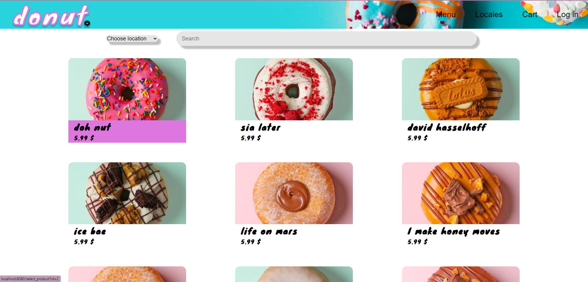
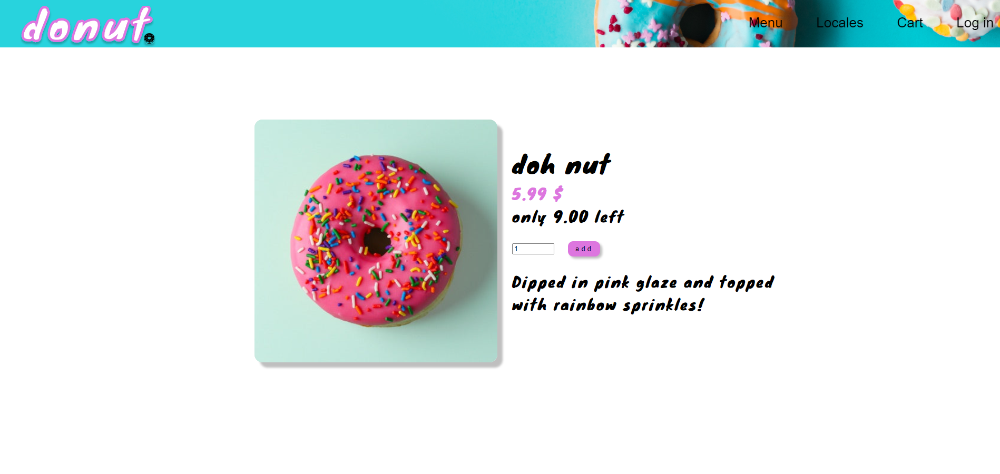
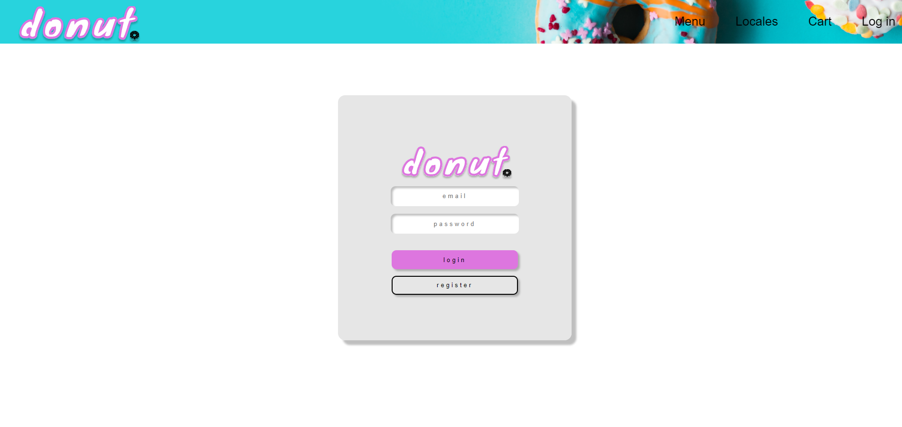
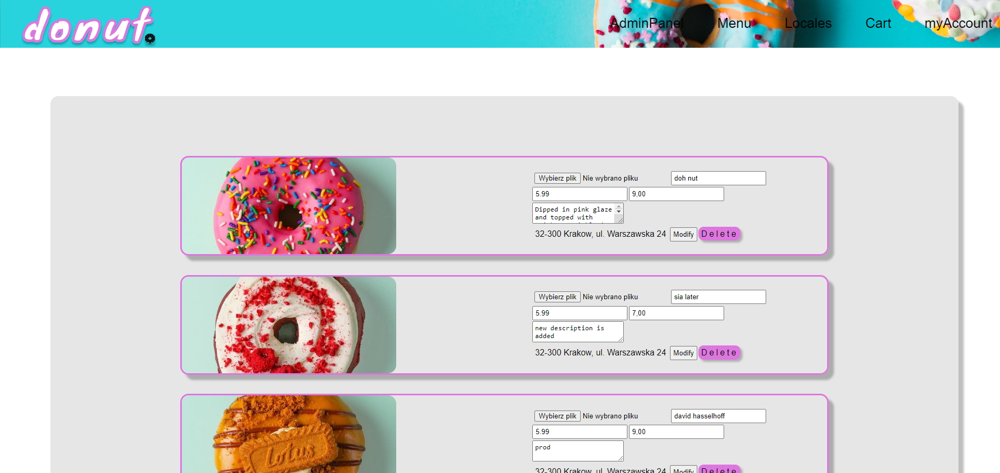
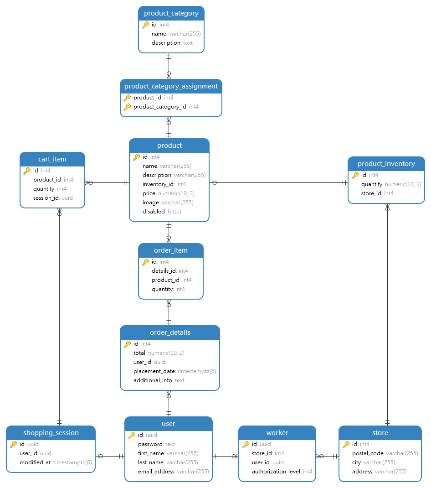

# uni_web_project

## Contents

- Introduction
- Presentation
- Requirements
- Installation
- User data
- Maintainers

## Introduction

Application simulating donut shop reservation site, where you can place your order and pick it up in one of locales. 
Unregistered users can observe/check out some of shops products, in order to add products to cart, users are asked to 
login/register, then they can place an order. 
Admin can add new products, modify or delete existing ones and view orders history.
Every user has option to change their personal data.

## Presentation

## Requirements

Application requirements:

- [Docker](https://www.docker.com/)

## Installation 

Run application using `docker-compose up` command while inside application directory, then
visit http://localhost:8080/main or http://127.0.0.1:8080/main in your web browser.

## User data

Admin: 
  email: admin@admin.com
  password: admin

User:
  email: user@user.com
  password: user

## Maintainers

Current maintainers:
- Aleksander Pasich ([@github](https://github.com/Alex555eu))
