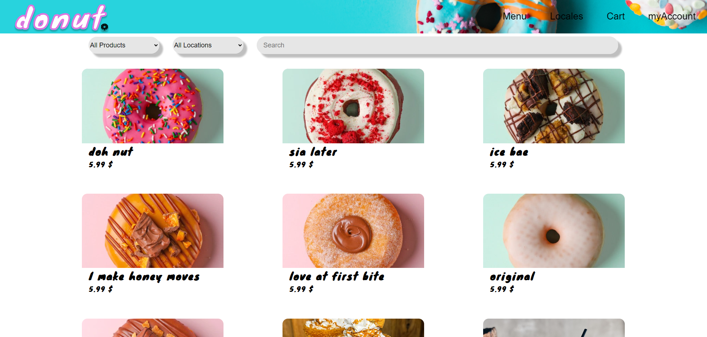

# Donut Shop

## Contents

- Introduction
- Dummy data
- Presentation
- Requirements
- Installation
- Troubleshooting
- Maintainers

## Introduction

Application simulating donut shop reservation site, where you can place your order and pick it up in one of locales. 
Unregistered users can observe/check out some of shops products, in order to add products to cart, users are asked to 
login/register, then they can place an order. 
Admin can add new products, modify or delete existing ones and view orders history.
Every user has option to change their personal data.


## Dummy data

Admin:
email: `admin@admin.com`
password: `admin`

User:
email: `user@user.com`
password: `user`


## Presentation




## Requirements

Application requirements:

- [Docker](https://www.docker.com/)

## Installation 
1. **Clone the Repository:**
   ```bash
   git clone https://github.com/Alex555eu/uni_web_project.git
   ```
2. **Start Application:**</br>
  Move to the folder of cloned project and start application using `docker-compose up` command.
</br></br>
3. **Open Application**</br>
  Once the application is started, you can visit http://localhost:8080/main or http://127.0.0.1:8080/main in your web browser.


## Troubleshooting

**Symptoms:**
- Receiving an error: `Connection failed: SQLSTATE[08006] [7] could not translate host name "db" to address: Try again`

**Possible Causes:**
- Database container created, but stuck in a stopped state.

**Troubleshooting**
  - Access the 'Docker Desktop' application and manually start db container, or restart all containers with commands
  `docker-compose stop` and then `docker-compose start`.


## Maintainers

Current maintainers:
- Aleksander Pasich ([@github](https://github.com/Alex555eu))
